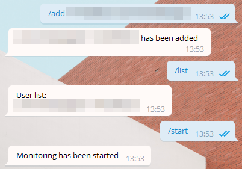
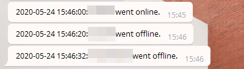

#  Telegram online status logger bot.

> "I solemnly swear that I am up to no good."
> 
> ~ Harry Potter Universe

  Uses Telethon library to check online status and if it was changed. 
  If changes are detected, a bot will send you a message.

---

## How it works

 The `spy.py` will host a bot that you can interact with.
 On Telegram you chat with the bot and through the bot commands you add/remove users on the monitoring list.



 The bot will message you, if any of the users on the list changed their online status.



## Install

` pip install telethon`
 
## Setup

Create your telegramm application on https://my.telegram.org/apps and replace API_HASH, API_ID with yours.

```
API_HASH = 'your api hash'
API_ID = 'yuor api id'
BOT_TOKEN = "your bot token"
USER_NAME = "your user name"
```

Create bot in your telegram client (write a message to @BotFather) and copy bot token into app.

## Run

  `python3 spy.py`
  
  Then input **your telegram account number** which will be sending requests to get users online status. Do not enter a bot token as this will not work.
  
  Input  code in console from telegram.
  
### Commands
  
  Write /help to your bot to see usage information.

```
/start - start online monitoring 
/stop - stop online monitoring 
/help - show help 
/add - add user to monitoring list "/add +79991234567 UserName"
/list - show added users
/clear - clear user list
/remove - remove user from list with position in list (to show use /list command)"/remove 1"
/setdelay - set delay between user check in seconds
/logs - display command log
/clearlogs - clear the command log file
/cleardata - reset configuration
/disconnect - disconnect bot
/getall - status
```

---

### Crontjob

Handy cronjob makros

- start background process:

#!/bin/bash
cd /home/DIRECTORY/TelegramOnlineSpy
nohup python3 spy.py > nohupper.log &

- check if background process is still running

```bash
#!/bin/bash
cd /home/DIRECTORY/TelegramOnlineSpy
minimum_finds=2
found=$(ps aux | grep "python3 spy.py" | wc -l)
if ((found < minimum_finds)); then
   # DO SOMETHING WHEN YOUR SPY IS OFFLINE
   # eg. alert the user or restart the spy
fi
```

check if spy is running every hour

```bash
32 * * * * /home/DIRECTORY/TelegramOnlineSpy/checkrunning.sh
```


